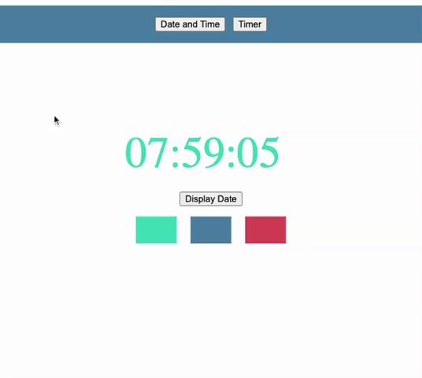

# A React Clock App 

### An app built to practice:

- lifecycle methods in class components (components/Clock.js)
- useEffect method in functional components (components/Timer.js)
- separation of concerns (container from presentational components)




## Quick Start
### Install Dependencies

```
npm install
```
### Run
```
npm start
```
### Author

Andrew Stratton

### Version

1.0.0
